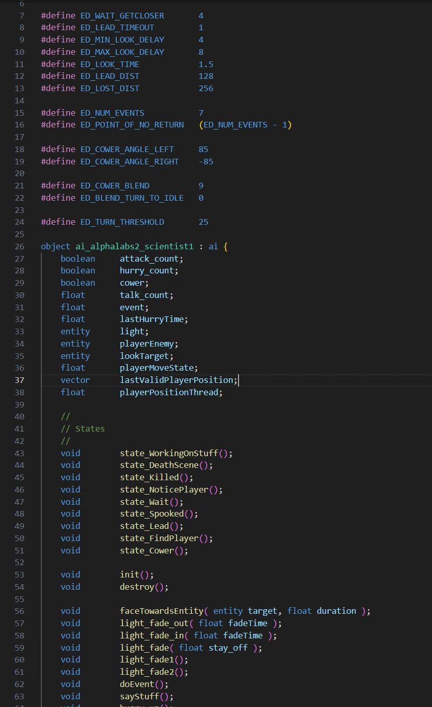

This is a great start for your guide! To make it more user-friendly and polished, you can expand it slightly and structure it better. Here's a revised version:

---

# **Doom 3 Script Highlighter**

This Visual Studio Code extension provides syntax highlighting and basic auto-completion for Doom 3 scripts (`.script` files). Follow the steps below to install and use it.

---

## **Installation**

1. **Clone the Repository**  
   Clone this repository to your local machine:
   ```bash
   git clone https://github.com/CitroenGames/doom3script-hightlighter
   ```

2. **Open the Project in VS Code**  
   - Navigate to the root directory of the repository using your terminal.  
     Example:
     ```bash
     cd doom3script-highlighter
     ```
   - Open the project in Visual Studio Code:
     ```bash
     code .
     ```

3. **Launch the Extension**  
   - Press `F5` in Visual Studio Code.  
   - This will start a new instance of VS Code with the extension loaded and ready to use.

---

## **Features**
- **Syntax Highlighting**  
  Automatically highlights Doom 3 script keywords, functions, variables, and comments.
  
- **Auto-Completion**  
  Provides suggestions for Doom 3 script functions and keywords as you type.

- **Comment Styling**  
  Formats both single-line (`//`) and block (`/* ... */`) comments.

---

## **Example**

Here's how a `.script` file looks with the highlighter:



---

## **Feedback and Contributions**
- If you find any bugs or have suggestions, feel free to open an issue on the [GitHub Issues](#) page.
- Contributions are welcome! Fork the repo, make your changes, and submit a pull request.
